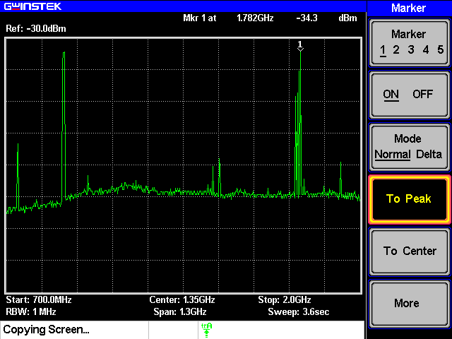
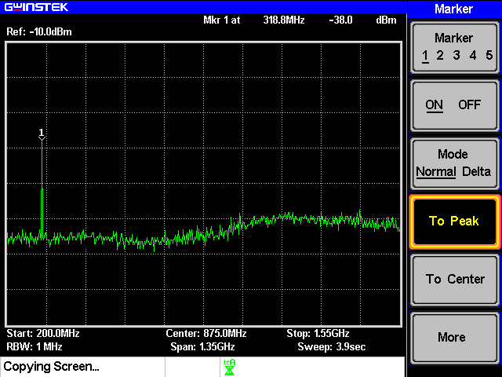
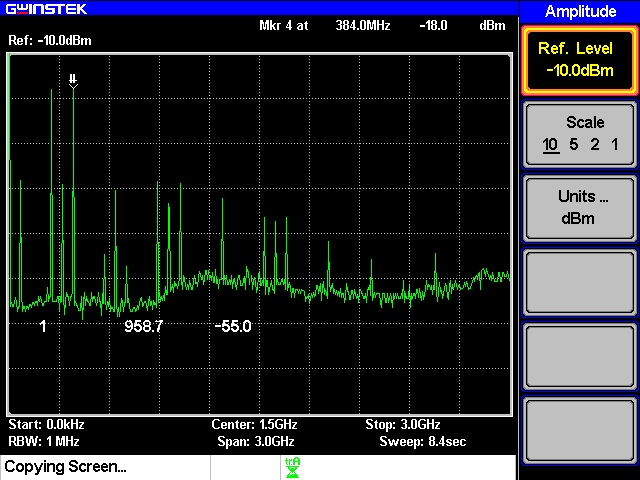
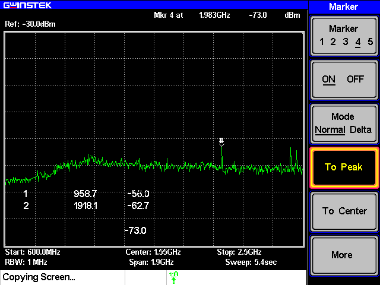

# 実験レポート  3I40宮脇海里
## 実験名：AM 変調送受信の実験  
### 実験日：2025年1月24日  

## 共同実験者
|3IXX|名前|
|-|-|
|10|大杉|
|20|杉本|
|30|平田|
---

## 1．目的  
AM 変調の送受信実験を通じて，高周波機器および計測器の取り扱いについて学ぶ． 

---

## 2．AM 変調・復調の原理  
以下に AM 変調および復調の原理について簡潔に説明する。  

### 2-1．AM 変調  
振幅変調（Amplitude Modulation, AM）は、搬送波（Carrier Wave）の振幅を音声や画像などの信号（変調波）に応じて変化させる変調方式である。この方式では、搬送波に加えて、信号のスペクトル成分が変調周波数の上下に現れる。  

### 2-2．AM 復調  
復調は、受信した変調信号から元の信号成分を取り出す操作である。ダイオードや同期検波回路を使用して行われることが多い。  

---

## 3．スペクトラム・アナライザとは  
スペクトラム・アナライザ（以下、スペアナ）は、信号の周波数成分を解析し、それを視覚的に表示する装置である。本実験では、スペアナを用いて信号の周波数スペクトルを観測し、変調および復調の特性を確認する。  

---

## 4．課題と実験手順および結果  

今回の実験では、RFリンクファミリーを用いる。

### 4-1．各自が使用している携帯電話の使用周波数を、スペアナを用いて確認せよ  
#### 手順  
1. スペアナの Port1 にアンテナ（ANT2000）を接続する。  
2. スペアナの設定を以下のように行う：  
   - Start frequency: 700 MHz  
   - Stop frequency: 2 GHz  
   - Others: Auto settings
3. 携帯電話を発信して、周波数スペクトルを観測する。  
4. 使用周波数を読み取る。  

#### 実験結果  
- 測定した周波数：1.782  GHz  

---

### 4-2．信号発生器の出力波形とバンドパスフィルタの影響を確認せよ  
#### 手順  
1. 信号発生器の出力をスペアナに接続し、周波数スペクトルを観測する。  
2. バンドパスフィルタを接続し、再度スペクトルを観測する。  

#### 実験結果  
- 信号発生器のみの場合：  
高調波：319.9 MHz, 638.9 MHz, 958.7 MHz, 1278 MHz, 
  
- バンドパスフィルタ接続後：
  

---

### 4-3．一段目のミキサ（MIX0400u）の出力周波数スペクトルを確認せよ  
#### 手順  
1. 一段目のミキサを組み立てる。  
2. ミキサの出力をスペアナで観測する。  

#### 実験結果  

---

### 4-4．送信側のモジュールを完成させ、アンテナからの送信波を観測せよ  
#### 手順  
1. 送信側のモジュールを完成させる。  
2. アンテナから送信波を確認する。  

#### 実験結果  
- 送信波の周波数：1983 MHz  

---

### 4-5．AM 変調の送受信実験を行い、受信波形を確認せよ  
#### 手順  
1. 実験装置を接続し、送信側から信号を送る。  
2. 受信側で復調信号を確認する。  

#### 実験結果  
音声が聞こえました

---

## 5．考察  
1. 各課題の結果を基に、観測結果や実験過程で得られた知見を記述する。  
2. AM 変調および復調における理論値と実験値の差異について考察する。  
3. 機器の取り扱いにおける留意点や改善点を述べる。  

### 1. 各課題の結果を基に、観測結果や実験過程で得られた知見を記述する。
観測結果から、AM変調の特性が確認できた。特に、4-2の実験結果では、バンドパスフィルタの効果が明確に示されている。

### 2. AM 変調および復調における理論値と実験値の差異について考察する。
理論値と実験値の差異については、使用機器の精度や環境ノイズの影響が考えられる。特に高周波帯での測定では、これらの要因が顕著になる可能性がある。

### 3. 機器の取り扱いにおける留意点や改善点を述べる。
同軸ケーブルは繊細なので、巻いたり衝撃を与えたりしないよう注意を払う。
また、接続の際は、必ずケーブル側のコネクタを回すこと。（プローブ側のコネクタは回さない）
4-4,4-5でアンテナを用いる際は、できるだけ変調波にノイズが乗らないようにアンテナの位置、向きを調節する。
---

## 6．結論  
- 本実験の目的である AM 変調および復調の原理理解が達成できたかについて述べる。  
- 実験結果を総括し、改善点や今後の課題を記述する。  

本実験を通じて、AM変調および復調の原理理解が深まった。特に、スペクトラム・アナライザを用いた周波数分析により、理論と実践の関連性を深く理解することができた。今後の課題としては、FM変調や、PSKについても理解したい。

---

## 7．参考文献  

---
