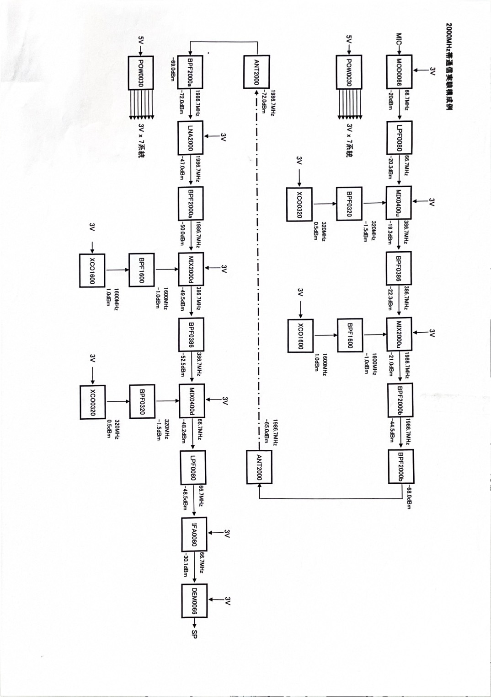

# 実験レポート 3I40 宮脇海里

## 実験名：AM 変調送受信の実験

### 実験日：2025 年 1 月 24 日

## 共同実験者

| 3IXX | 名前 |
| ---- | ---- |
| 10   | 大杉 |
| 20   | 杉本 |
| 30   | 平田 |

---

## 1．目的

AM 変調の送受信実験を通じて，高周波機器および計測器の取り扱いについて学ぶ．

---

## 2．AM 変調・復調の原理

以下に AM 変調および復調の原理について簡潔に説明する。

### 2-1．AM 変調

振幅変調（Amplitude Modulation, AM）は、搬送波（Carrier Wave）の振幅を音声や画像などの信号（変調波）に応じて変化させる変調方式である。この方式では、搬送波に加えて、信号のスペクトル成分が変調周波数の上下に現れる。

### 2-2．AM 復調

復調は、受信した変調信号から元の信号成分を取り出す操作である。ダイオードや同期検波回路を使用して行われることが多い。

---

## 3．スペクトラム・アナライザとは

スペクトラム・アナライザ（以下、スペアナ）は、信号の周波数成分を解析し、それを視覚的に表示する装置である。本実験では、スペアナを用いて信号の周波数スペクトルを観測し、変調および復調の特性を確認する。

---

## 4．課題と実験手順および結果

今回の実験では、RF リンクファミリーを用いる。

### 4-1．各自が使用している携帯電話の使用周波数を、スペアナを用いて確認せよ

#### 手順

1. スペアナの Port1 にアンテナ（ANT2000）を接続する。
2. スペアナの設定を以下のように行う：
   - Start frequency: 700 MHz
   - Stop frequency: 2 GHz
   - Others: Auto settings
3. 携帯電話を発信して、周波数スペクトルを観測する。
4. 使用周波数を読み取る。

#### 実験結果

- 測定した周波数：1.782 GHz  
  

---

### 4-2．信号発生器の出力波形とバンドパスフィルタの影響を確認せよ

#### 手順

1. 信号発生器の出力をスペアナに接続し、周波数スペクトルを観測する。
2. バンドパスフィルタを接続し、再度スペクトルを観測する。

#### 実験結果

- 信号発生器のみの場合：  
  高調波：319.9 MHz, 638.9 MHz, 958.7 MHz, 1278 MHz,
  
- バンドパスフィルタ接続後：
  

---

### 4-3．一段目のミキサ（MIX0400u）の出力周波数スペクトルを確認せよ

#### 手順

1. 一段目のミキサを組み立てる。
2. ミキサの出力をスペアナで観測する。

#### 実験結果

---

### 4-4．送信側のモジュールを完成させ、アンテナからの送信波を観測せよ

#### 手順

1. 送信側のモジュールを完成させる。
2. アンテナから送信波を確認する。

#### 実験結果

- 送信波の周波数：1983 MHz  
  

---

### 4-5．AM 変調の送受信実験を行い、受信波形を確認せよ

#### 手順

1. 実験装置を接続し、送信側から信号を送る。
2. 受信側で復調信号を確認する。

#### 実験結果

音声が聞こえました

---

### 機器の取り扱いにおける留意点

同軸ケーブルは繊細なので、巻いたり衝撃を与えたりしないよう注意を払う。
また、接続の際は、必ずケーブル側のコネクタを回すこと。（プローブ側のコネクタは回さない）
4-4,4-5 でアンテナを用いる際は、できるだけ変調波にノイズが乗らないようにアンテナの位置、向きを調節する。

## 5．考察

### 実験 1

測定した周波数：1.782 [GHz] に対し、携帯電話で使用される主な周波数帯は 1.7KHz なので、おおむねうまく測定できている。

### 実験 2

結果から、`XCO0320`は 320[MHz]間隔で信号を発生させると考えられる。また`BPF0320`を用いた場合は約 320[MHz]帯の周波数のみを通すと考えられる。

### 実験 3

ミキサによって新たな周波数成分が生成されている？

### 実験 4

送信波の周波数：1983 [MHz]を観測したが、`ANT2000`を用いて用いて通信しているため、2000[MHz]付近が観測されていると考えられる。

### 実験 5

クリアとは言えないが原曲がなにかわかる程度のひずみで音が聞こえたので実験成功。

### AM 変調および復調における理論値と実験値の差異について

理論値と実験値の差異については、使用機器の精度や環境ノイズの影響が考えられる。特に高周波帯での測定では、これらの要因が顕著になる可能性がある。

---

## 感想

本実験を通じて、AM 変調および復調の原理理解が深まった。特に、BPF はフィルタだけではなく減衰器として用いられることもあるということを学んだ。今後の課題としては、FM 変調や、PSK についても理解したい。

---
